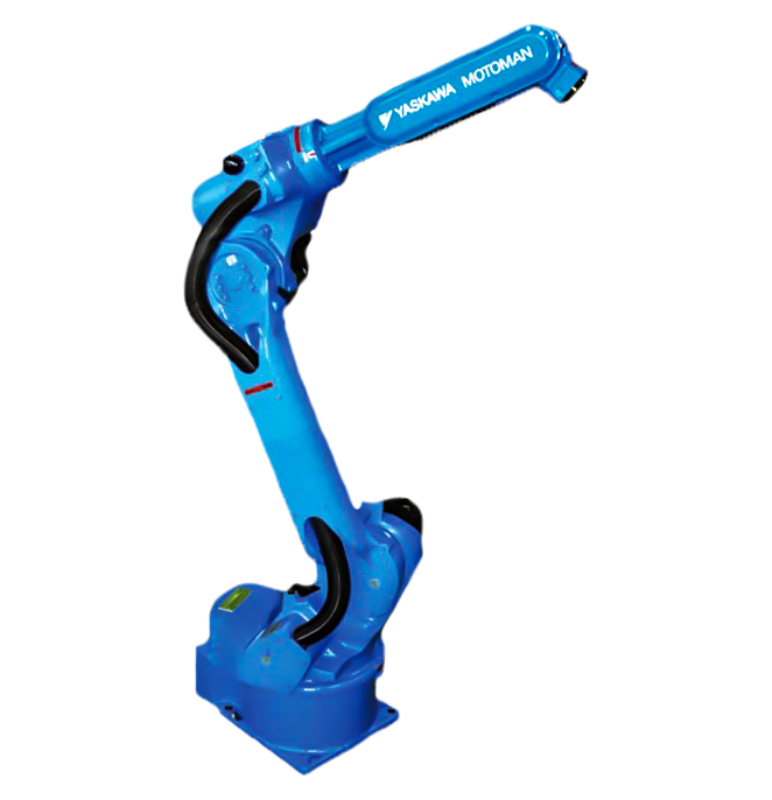
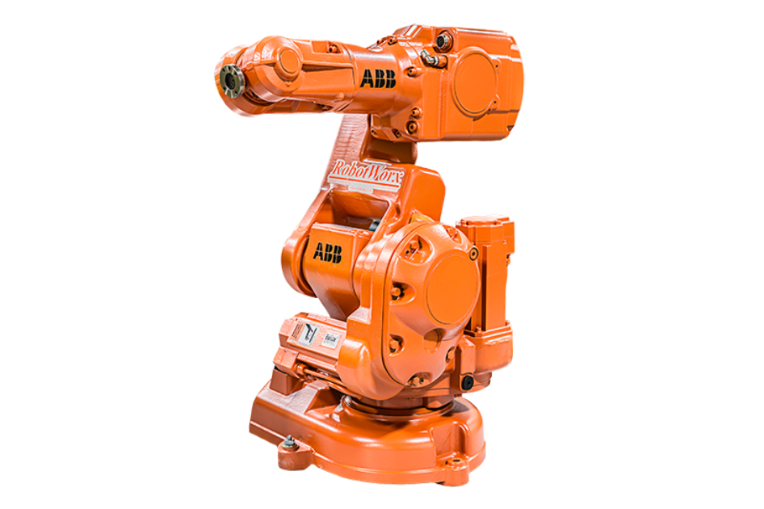
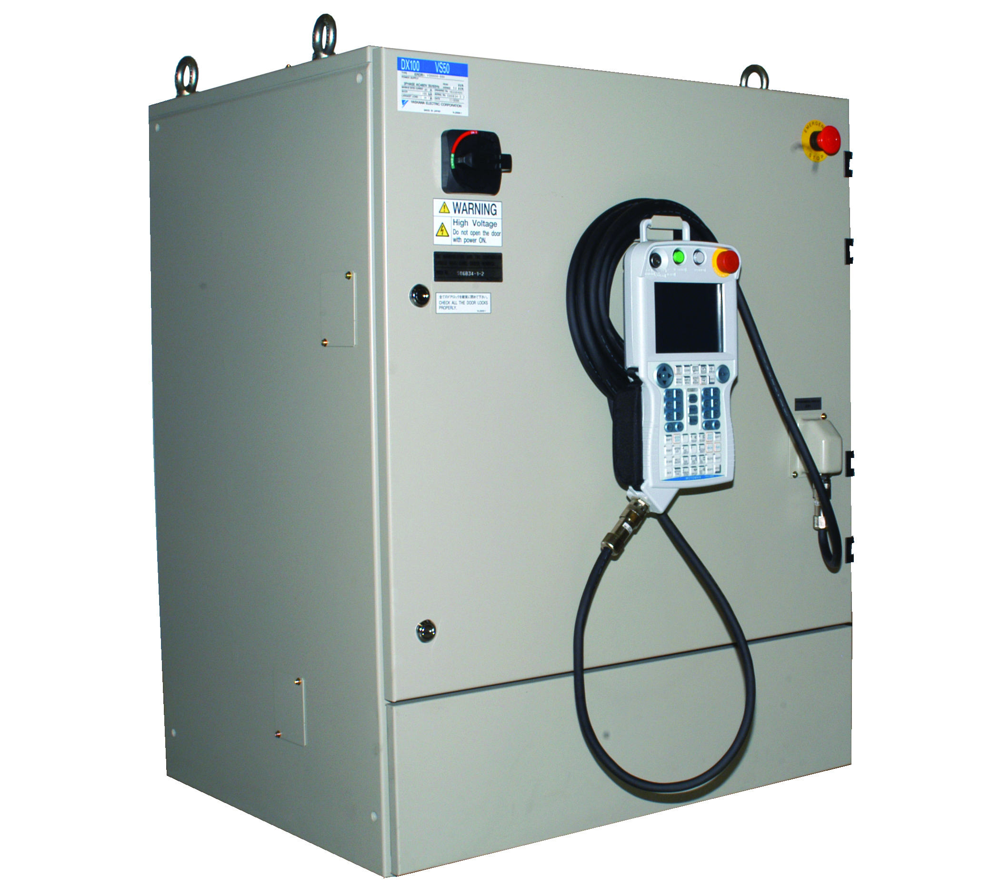
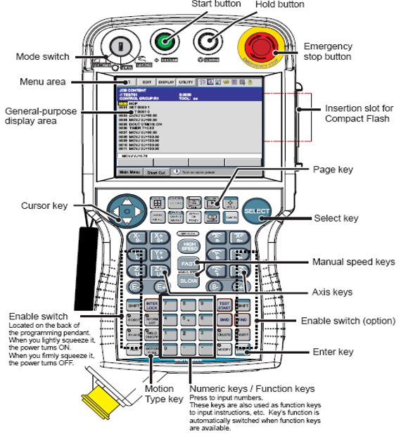
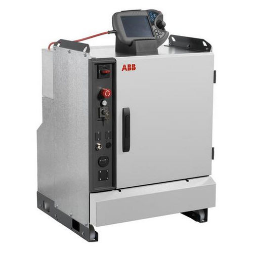
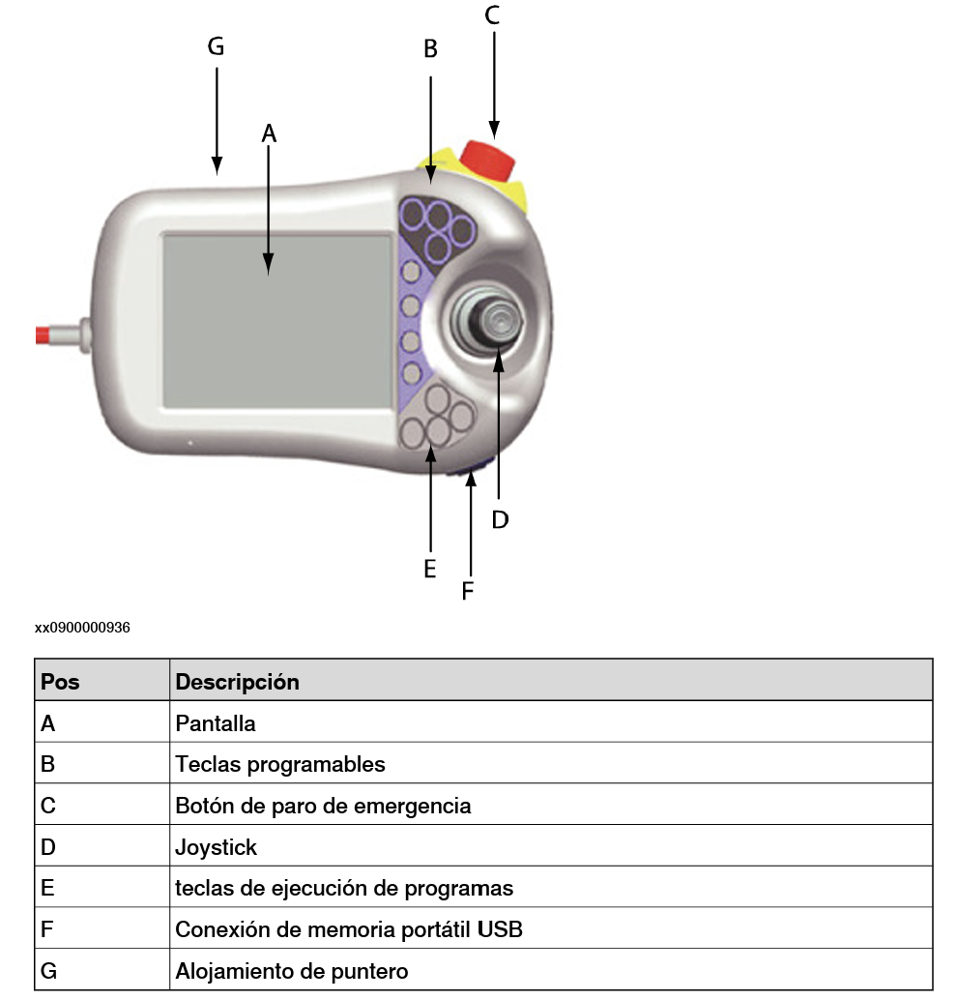

# Laboratorio N°2 - Robotica- Operación, Análisis y Comparación del Manipulador Motoman MH6

Integrantes: Catalina Criollo Castelblanco - Diego Fernando Malagón Saenz

# Resumen

En este informe de laboratorio se comparan dos manipuladores ampliamente utilizados en la industria: el Motoman MH6 de Yaskawa y el ABB IRB 140 de ABB. La comparación se realiza en función de especificaciones técnicas, control y aplicaciones, con el fin de determinar cuál es más adecuado para diferentes escenarios industriales.


# Comparación

* Motoman MH6:
  


* ABB IRB 140:
  


## Especificaciones Técnicas

| Característica | Motoman MH6 | ABB IRB 140 |
| --- | --- | --- |
| Fabricante | Yaskawa Motoman | ABB|
| Grados de libertad (DOF) | 6 | 6 |
| Capacidad de carga | 6 kg | 6 kg |
| Alcance máximo | 1422 mm  | 810 mm |
| Repetibilidad | ±0.08 mm | ±0.01 mm |
| Peso | 130 kg | 98 kg |
| Montaje | Suelo, pared, techo | Suelo, pared, inclinado, techo| 
| Velocidad máxima por eje | 200-250°/s | 250-300°/s |
| Controlador | DX100/ DX200 | IRC5 |
| Software de programación | MotoPlus, INFORM II | RAPID|
| Aplicaciones principales | Soldadura, ensamblaje, manipulación de materiales | Ensamblaje, manipulación de materiales, carga/descarga, soldadura |

## Movimiento del robot

### Motoman MH6:

| Eje | Rango de movimiento | 
| --- | --- | 
| Eje -S (Giro)| ±170°|
| Eje -L (Brazo inferior)| +155°, -90°|
| Eje -U (Brazo superior)| +250°,-175°|
| Eje -R (Rotación de la muñeca)| ±180°|
| Eje -B (Inclincación de la muñeca)| +255°, -45°|
| Eje -T (Giro de la muñeca)| ±360°|

### ABB IRB 140:

| Eje | Rango de movimiento | 
| --- | --- | 
| Eje -1 (Movimiento de rotación)| ±180°|
| Eje -2 (Movimiento del brazo)| +110°, -90°|
| Eje -3 (Movimiento del brazo)| +50°,-230°|
| Eje -4 (Movimiento de la muñeca)| ±200°|
| Eje -5 (Movimiento de doblado)| ±120°|
| Eje -6 (Movimiento de giro)| ±400°|

## Controlador 
### Motoman MH6:
  
  
  
El DX100 es un controlador cuenta con una interfaz intuitiva que simplifica la programación y el manejo del robot, reduciendo los tiempos de configuración y mejorando la productividad en entornos de manufactura complejos.

Una de sus principales ventajas es su capacidad multi-robot, ya que puede controlar hasta 8 robots simultáneamente (72 ejes en total). Esto lo convierte en una opción ideal para aplicaciones que requieren la sincronización de múltiples robots en celdas de producción de alta densidad. Su arquitectura modular y centralizada permite la gestión eficiente de manipuladores, optimizando los tiempos de respuesta mediante procesamiento en paralelo. Además, su diseño compacto reduce el espacio ocupado en la celda de trabajo, facilitando la integración en distintas configuraciones industriales.

La programación del DX100 se basa en el lenguaje INFORM, desarrollado por Motoman. Aunque es un sistema potente y versátil, presenta una curva de aprendizaje más pronunciada en comparación con otros entornos de programación más intuitivos. El controlador permite la programación en línea a través de un teach pendant con pantalla a color, así como programación offline mediante el software MotoSim, lo que ofrece flexibilidad para simular y optimizar tareas antes de su implementación en la producción.

En términos de conectividad, el DX100 está diseñado principalmente para la coordinación de múltiples robots dentro de una celda de trabajo, pero también ofrece compatibilidad con diversos protocolos de comunicación industrial. Soporta Ethernet/IP, DeviceNet, Profibus y CC-Link, permitiendo la integración con PLCs y sistemas SCADA. Además, cuenta con soporte para visión artificial y sensores externos, lo que amplía su aplicabilidad en entornos de manufactura avanzada.
* Teach Pendant
  
  

Este Teach Pendant cuenta con un diseño compacto y ligero, pensado para facilitar su uso en largas jornadas. Presenta una pantalla a color con botones físicos dedicados para navegación y control. Su disposición de botones esta pensada para optipimzar la programación en lenguaje INFORM. Se destaca que incorpora un dial de desplazamiento manual (jog dial) para ajustar movimientos con precisión. Otro punto a mencionar es que requiere el uso de combinaciones de botones físicos para acceder a ciertas funciones. Y aunque eficiente, la navegación puede resultar menos intuitiva para nuevos usuarios.

      
### ABB IRB 140:
  
  
 
El IRC5 es un controlador modular y escalable de quinta generación desarrollado por ABB, diseñado para ofrecer un control avanzado y preciso del movimiento de los robots industriales. Su arquitectura flexible permite la personalización mediante módulos adaptables a distintas aplicaciones, garantizando un rendimiento óptimo en términos de velocidad, precisión y sincronización con dispositivos externos.

Uno de sus principales diferenciadores es su tecnología de control de movimiento, basada en TrueMove™ y QuickMove™. TrueMove™ asegura trayectorias suaves y exactas independientemente de la velocidad, mientras que QuickMove™ optimiza la aceleración y desaceleración, reduciendo los tiempos de ciclo al mínimo posible. Gracias a su modelado dinámico avanzado, el IRC5 entrega un comportamiento predecible y de alto rendimiento sin necesidad de ajustes adicionales por parte del programador.

El controlador opera con RobotWare, un sistema operativo que facilita actualizaciones y personalización, además de permitir la integración con dispositivos externos y periféricos. Su lenguaje de programación, RAPID, combina simplicidad, flexibilidad y potencia, ofreciendo un entorno sin restricciones con múltiples funciones avanzadas. Este lenguaje es más intuitivo y accesible en comparación con otros sistemas, brindando un amplio soporte para diversas aplicaciones industriales.

La programación del IRC5 se potencia con RobotStudio, un entorno de simulación que permite desarrollar, probar y optimizar programas tanto online como offline, reduciendo tiempos de configuración y mejorando la productividad. Su teach pendant cuenta con una interfaz gráfica avanzada y pantalla táctil, lo que facilita la interacción con el sistema y la programación en tiempo real.

En términos de conectividad, el IRC5 es compatible con una amplia gama de protocolos industriales, como OPC UA, PROFINET, EtherNet/IP y Modbus, lo que le permite integrarse fácilmente en entornos de automatización interconectados. Su compatibilidad con visión artificial, sensores inteligentes y sistemas de seguridad lo hace ideal para aplicaciones de manufactura avanzada. Además, su capacidad de comunicación con la nube e IoT le permite adaptarse a los requerimientos de la Industria 4.0.


* Teach Pendant
  
  
El FlexPendant cuenta con una construcción más robusta, con un diseño ligeramente más pesado en comparación con otros modelos, pero optimizado para un uso ergonómico en entornos industriales.

Su característica más destacada es su pantalla táctil a color de gran tamaño, que permite una interacción más fluida y visual, reduciendo la dependencia de botones físicos. La interfaz gráfica avanzada, basada en íconos y menús desplegables, facilita la navegación y el acceso rápido a funciones clave, lo que agiliza la programación y configuración del robot.

Una de sus grandes ventajas es la flexibilidad en la disposición de comandos, ya que su interfaz puede personalizarse según las necesidades del usuario. Además, permite la edición de trayectorias en tiempo real de una manera más visual y dinámica, facilitando los ajustes y optimizaciones sin necesidad de reprogramar desde cero.
    
## Software de programación

### INFORM (Yaskawa/Motoman)

* Basado en una estructura de líneas secuenciales, más parecido a un lenguaje de programación estructurada como BASIC.
* Utiliza una combinación de comandos de menú y líneas de código que pueden hacer que la programación sea menos intuitiva para usuarios nuevos.
* Soporta estructuras básicas de control (if, loops simples), pero con menos opciones avanzadas que RAPID.
* Compatible con MotoSim, que permite simulación.
* Enfocado en la programación directa desde el teach pendant, con menos énfasis en simulación offline.
* Más utilizado en celdas de trabajo con múltiples robots, ya que el DX100 (su controlador principal) permite el manejo de hasta 8 robots en simultáneo.
* Enfocado en automatización industrial tradicional, donde la programación en línea es prioritaria.
* Ideal para líneas de producción de alta densidad y sincronización de múltiples robots.

Código de ejemplo:

```
NOP
MOVL P1 V=100.0
MOVJ P2 V=50.0
END
```
Con este ejemplo es posible evidenciar que se tiene un código secuencial, sin estructuras de modularidad. Los movimientos MOVL y MOVJ no presentan una capacidad avanzada de personalización. Y que este proceso es sdependiente de la programación a través del teach pendant.


### RAPID (ABB)

* Posee una sintaxis similar a lenguajes de alto nivel como Python o C, lo que lo hace más intuitivo para programadores con experiencia previa en otros lenguajes.
* Se estructura en módulos y rutinas, lo que facilita la organización del código y su reutilización.
* Cuenta con funciones y variables bien definidas, lo que mejora la legibilidad del código.
* Soporta estructuras de control avanzadas (if, while, for, switch-case), lo que facilita la programación lógica y adaptable.
* Tiene una gran capacidad de personalización y manipulación de datos.
* Mejor opción para entornos donde se requiere programación estructurada y flexible.
* Adecuado para proyectos de integración con IoT y sistemas en la nube.
  
Código de ejemplo:

```
MODULE MainModule
  VAR robtarget p1:=[100,200,300,0,0,1,0];
  
  PROC main()
    MoveJ p1, v100, fine, tool0;
    MoveL p1, v50, z10, tool0;
  ENDPROC
ENDMODULE
```
Con este ejemplo es posible evidenciar que se tiene un código estructurado en módulos y procedimientos, más legible y reutilizable. Se emplea el uso de variables robtarget para definir posiciones. Y se usan comandos MoveJ y MoveL para movimientos con control de velocidad y precisión.

## Plataformas de simulación y programación

### RoboDK
RoboDK es un software versátil compatible con más de 50 marcas de robots, lo que lo convierte en una solución ideal para entornos con múltiples fabricantes. Permite la exportación de programas a diversos controladores y lenguajes de programación (RAPID, INFORM, KRL, TP, etc.), aunque no emula con precisión los controladores reales, sino que traduce el código según el robot utilizado.

Su enfoque se centra en la simulación de trayectorias y movimientos de manera general, con menor integración de procesos avanzados como visión artificial o sensores. Su interfaz intuitiva lo hace accesible para principiantes, permitiendo la generación de trayectorias sin necesidad de conocimientos profundos en programación o controladores específicos.

Es ampliamente utilizado en educación, investigación y programación multimarca, con aplicaciones en mecanizado, impresión 3D y paletizado gracias a su capacidad de importar modelos CAD. Además, su costo accesible y compatibilidad con hardware modesto lo hacen una opción flexible y eficiente.

### RobotStudio

RobotStudio es el software exclusivo de ABB, compatible únicamente con su controlador IRC5 y versiones anteriores. Basado en el lenguaje RAPID, permite simular con precisión el comportamiento real del robot, ofreciendo control avanzado del movimiento en tiempo real.

Su integración con herramientas de visión artificial, sensores y automatización en la nube lo hace ideal para la optimización de trayectorias y simulaciones detalladas en entornos de producción. Aunque su interfaz ofrece amplias opciones de configuración, está orientada a ingenieros con experiencia en ABB, lo que implica una curva de aprendizaje más pronunciada.

Requiere hardware potente para simulaciones avanzadas y su licencia comercial tiene un costo elevado, aunque dispone de una versión gratuita con funciones limitadas.

Dado lo anterior, se puede presentar la comparación entre RoboDK y RobotStudio por medio de la siguiente tabla:

### Tabla de comparación

| Característica | RoboDK | RobotStudio|
| --- | --- | --- |
| Compatibilidad | Multimarca (ABB, Yaskawa, KUKA, etc.) | SoloABB|
|Programación | Lenguaje adaptable según el robot | RAPID |
|Simulación | Más genérica, sin emulación del controlador | Precisa con control exacto del robot ABB |
| Facilidad de uso | Más intuitivo y accesible | Más complejo, orientado a expertos en ABB |
| Costo | Más accesible y con licencias flexibles | Alto, pero con versión gratuita limitada |

## Aplicaciones industruales

### Motoman MH6:
* El Motoman MH6 es un robot industrial versátil diseñado para una amplia variedad de aplicaciones en sectores como manufactura, ensamblaje, logística y automotriz. Su diseño delgado, alta velocidad y capacidad de montaje en múltiples posiciones lo hacen ideal para entornos industriales donde se requiere precisión, flexibilidad y eficiencia. Entre sus principales aplicaciones se encuentra:
  
  - Manufactura aditiva: Puede integrarse en procesos de impresión 3D industrial para la deposición de material en múltiples capas.
  - Dispensado: Precisión en la aplicación de adhesivos, selladores o recubrimientos en líneas de producción automatizadas.
  - TCP remoto: Ajuste automático de la posición del herramental en tareas de alta precisión.
  - Soldadura: Especialmente en soldadura por arco, permitiendo un control preciso de la trayectoria y optimización del tiempo de ciclo.
  - Manipulación de materiales: Carga y descarga de máquinas (CNC, prensas); empaque y paletizado en la clasificación de productos en líneas de producción.
  - Ensamblaje: Integración en celdas de manufactura para el ensamblaje de productos complejos.
  - Pintura y recubrimientos: Aplicaciones de pintura industrial con movimiento preciso y repetitivo. Recubrimientos protectores y selladores en diversas industrias.
  - Corte por plasma y láser: Permitiendo formas complejas con alta precisión.
  
  ### ABB IRB 140:
* El ABB IRB 140 es un robot industrial compacto diseñado para aplicaciones que requieren alta precisión, velocidad y flexibilidad. Gracias a su capacidad de montaje en múltiples posiciones y su alta repetibilidad (±0.01 mm), es ideal para tareas exigentes que demandan exactitud y eficiencia. Entre sus principales aplicaciones se encuentra:
  -  Ensamblaje y la manipulación de piezas pequeñas:  Se destaca en la fabricación de dispositivos electrónicos, como teléfonos móviles, radios y circuitos integrados. Su capacidad para operar en salas limpias lo convierte en una opción ideal para la industria de semiconductores, donde la manipulación de microcomponentes requiere entornos controlados. Además, su rapidez y precisión lo hacen adecuado para el empaquetado y la clasificación de productos pequeños en líneas de producción automatizadas.
  -  Soldadura y acabado superficial: Desempeña un papel clave en la soldadura por arco, integrándose en celdas compactas como FlexArc® Compact, diseñadas para optimizar la producción en espacios reducidos. También es utilizado en tareas de pulido y desbarbado de aluminio, así como en el mantenimiento de prensas y otras máquinas industriales, garantizando superficies de alta calidad y reduciendo tiempos de procesamiento.
  -  Industria de fundición y moldeo: El IRB 140 está disponible con protección IP67, lo que le permite operar en entornos hostiles. Su diseño lo hace ideal para la pulverización de matriz en fundiciones y la manipulación en máquinas de fundición a presión, asegurando una aplicación uniforme y eficiente. En el sector del moldeo por inyección, es utilizado para cargar y descargar insertos y piezas moldeadas, agilizando el ciclo de trabajo y mejorando la productividad.
  -  Carga, descarga y manipulación de materiales: Se emplea en líneas de producción automatizadas, optimizando la transferencia de piezas y el mantenimiento de máquinas. Su capacidad para manipular materiales frágiles y de alta precisión le permite mejorar la calidad del proceso productivo, minimizando el margen de error y reduciendo el desgaste de los componentes.   

# Practica

Se realizo un código en python

# Conclusiones (falta redactar)
* Si se necesita mayor precisión y flexibilidad en espacios reducidos, el ABB IRB 140 es la mejor opción.
* Si se requiere mayor alcance, robustez y versatilidad en aplicaciones de soldadura y manipulación de materiales, el Motoman MH6 es más adecuado.
* Ambos robots son altamente eficientes, pero su selección debe basarse en los requisitos específicos de cada aplicación industrial.
* El Teach Pendant del DX100 es ideal para entornos industriales que requieren control centralizado de múltiples robots, con una programación detallada pero menos visual. Su enfoque en el lenguaje INFORM puede hacer que la curva de aprendizaje sea más pronunciada.
* El Teach Pendant del IRC5 ofrece una interfaz más intuitiva y moderna con pantalla táctil, facilitando la programación y configuración del robot. Su integración con RobotStudio y el uso de RAPID lo hacen más accesible y eficiente en la optimización de procesos industriales.
* En general, RAPID es más avanzado y flexible, ideal para aplicaciones donde se requiere personalización, integración con sistemas modernos y programación estructurada. INFORM, en cambio, está más enfocado en la programación de robots en entornos industriales con múltiples manipuladores, donde la rapidez en la configuración es clave.
* Si se necesita una simulación precisa y fiel al comportamiento real del robot ABB, RobotStudio es mejor. Si se necesita una herramienta más generalista para programar diferentes robots, RoboDK es la mejor opción.

# Referencias
* Especificaciones del producto Robot articulado IRB 140. ABB, s. f. [En línea]. Disponible: https://library.e.abb.com/public/4c9f370fc8f37781c1257b4b0051c907/3HAC10319-1_rev4_es_library.pdf
* Especificaciones del producto Controller IRC5 with FlexPendant RobotWare 5.15. ABB, s. f. [En línea]. Disponible: https://library.e.abb.com/public/2b5b950d68a0503cc1257c0c003cb703/3HAC041344-es.pdf
* Manuel d’instructions REFERENCIA PARA Tabla de instrucciones básicas Programación y reproducción simplificadas Listado de alarmas DX100. Motoman Yaskawa Co., s. f. [En línea]. Disponible: http://www.infoPLC.net
* MOTOMAN-MH6 INSTRUCTIONS. Yaskawa, s. f.
* “Controlador de seguridad para robots Yaskawa FSU - Robótica y automática - Controlador de seguridad para robots”. Interempresas: Productos e Información para la industria y la empresa. [En línea]. Disponible: https://www.interempresas.net/Robotica/FeriaVirtual/Producto-Controlador-de-seguridad-para-robots-Yaskawa-FSU-107633.html
* “¿Cómo mover un Robot Industrial? | Sigma imecsa”. Sigma Imecsa. [En línea]. Disponible: https://www.sigmaimecsa.com/como-mover-un-robot-industrial.html
